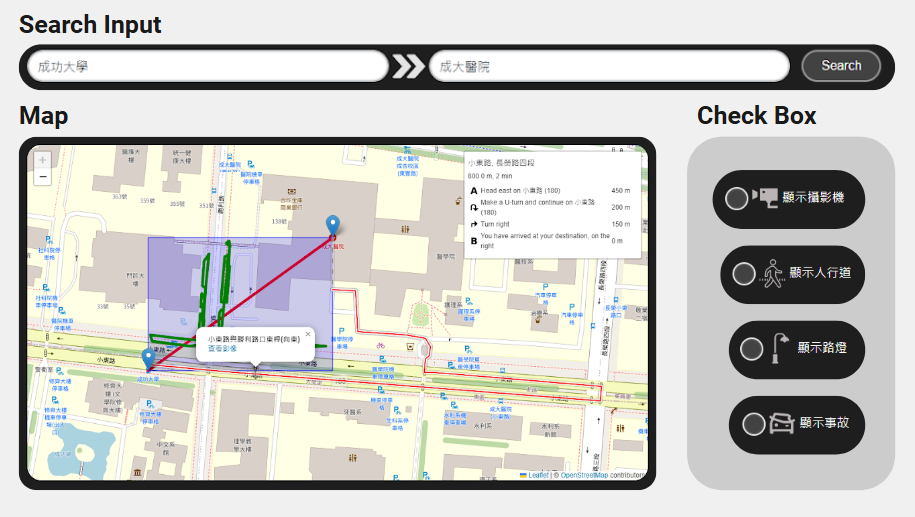
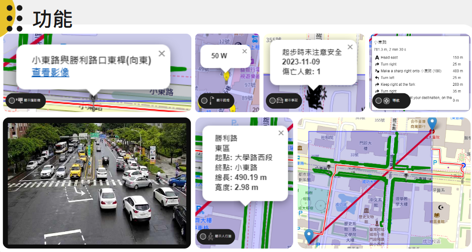

# One Road Good Go

《一路好走》是一個資料可視化網頁，結合了臺南市政府所釋出之[路況攝影機(CCTV)位置資料](https://data.tainan.gov.tw/dataset/cctv_location)、[臺南市路燈資料](https://data.tainan.gov.tw/dataset/pbw-streetlight)、[臺南市政府人行道資訊](https://data.tainan.gov.tw/dataset/sidewalk)、[臺南市道路交通事故原因傷亡統計](https://data.tainan.gov.tw/dataset/policedata016)之四開放資料集，呈現地理位置。

一如資料集所示，本網站分成四個可搜尋選項：攝影機、路燈、人行道、與交通事故。

在搜尋欄輸入臺南地標名後，便可進行路徑導航及以兩點為對角線所示矩形中，四選項之位置。

所有地圖所示元素皆是可點擊的（除少部分資料有殘缺以外）。人行道是以綠色粗線表示，其餘三者皆有自己的圖案。攝影機按下後網址可通往查看該攝影機的即時影像，路燈則可以看路燈功率，事故則可以看時間、事發原因、與傷亡人數（如果事故發生地點太過密集，會合併為同一圖標）。

